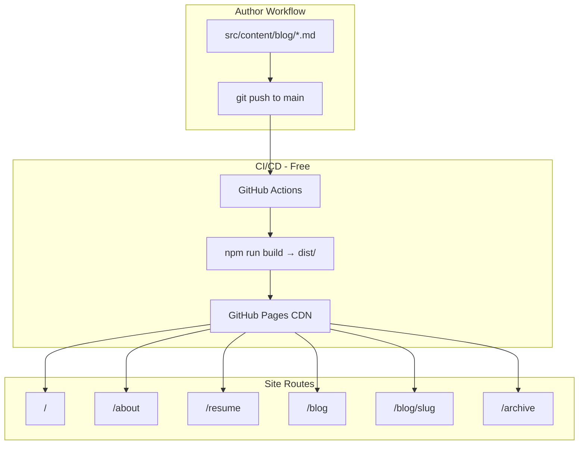

> **Agent ecosystem:** Execute this plan using workspace skills (`.cursor/skills/`), subagents (`.cursor/agents/`), and rules (`.cursor/rules/`). See `.cursor/rules/plan-execution.mdc` for todo → skill → subagent mapping. Kickoff: `@.cursor/plans/mr_brij_astro_site_e42034d2.plan.md` + `@.cursor/rules/plan-execution.mdc`

# Mr. Brij Personal Website — Detailed Build Plan

## Context & Decisions (Locked)

| Decision | Choice |
|----------|--------|
| Stack | Astro 5 + TypeScript + Tailwind CSS |
| Hosting | GitHub Pages (free) at `https://brijendrasingh.github.io/` |
| Design | Professional & minimal — credibility-first for a senior QA practitioner |
| Blog workflow | Markdown files in repo → `git push` → auto-deploy |
| Content | Migrate all 9 posts from [brijendrasingh.github.io-main/](brijendrasingh.github.io-main/) |
| Resume | Inline styled web page + downloadable PDF |
| LinkedIn | **https://www.linkedin.com/in/brijendrapsingh/** (updated) |

### Contact Config (single source of truth)

All contact links will live in one config file — never hardcoded in components:

```typescript
// src/config/site.ts
export const site = {
  name: "Brijendra Singh",
  brand: "Mr. Brij",
  tagline: "Software Quality Practitioner",
  description: "14+ years in software quality — test strategy, automation, and quality culture.",
  url: "https://brijendrasingh.github.io",
  email: "bps.brijendra@gmail.com",
  github: "https://github.com/brijendrasingh",
  linkedin: "https://www.linkedin.com/in/brijendrapsingh/",  // corrected URL
  copyrightYear: 2026,
};
```

Old Jekyll site had outdated LinkedIn at `in/brijendra-singh-56658b17/` in [_data/owner.yml](brijendrasingh.github.io-main/_data/owner.yml) and [_includes/util/auto-content-generator.liquid](brijendrasingh.github.io-main/_includes/util/auto-content-generator.liquid) — the new site replaces all of this with the config above.

---

## Architecture



---

## Project Structure

Build the new site at workspace root [`/Users/brijendrasingh/Documents/mypoc/mr-brij/`](file:///Users/brijendrasingh/Documents/mypoc/mr-brij/) (replacing the extracted Jekyll folder after migration):

```
mr-brij/
├── .github/workflows/deploy.yml
├── public/
│   ├── resume.pdf                    # downloadable resume
│   ├── images/blog/                  # migrated post images
│   ├── posts/                        # legacy URL redirect HTML files
│   ├── robots.txt
│   └── favicon.svg
├── src/
│   ├── config/site.ts                # brand, contact, nav (LinkedIn here)
│   ├── content/
│   │   ├── config.ts                 # blog collection schema
│   │   └── blog/                     # 9 migrated posts + future posts
│   ├── components/
│   │   ├── Header.astro
│   │   ├── Footer.astro
│   │   ├── BlogCard.astro
│   │   ├── PostMeta.astro
│   │   ├── ContactLinks.astro
│   │   └── SEO.astro
│   ├── layouts/
│   │   ├── BaseLayout.astro
│   │   └── PostLayout.astro
│   ├── pages/
│   │   ├── index.astro               # Home
│   │   ├── about.astro
│   │   ├── resume.astro
│   │   ├── archive.astro
│   │   ├── blog/index.astro
│   │   ├── blog/[...slug].astro
│   │   └── 404.astro
│   └── styles/global.css
├── astro.config.mjs
├── tailwind.config.mjs
├── package.json
└── README.md                         # "How to publish a blog post"
```

---

## Phase 1 — Scaffold & Tooling

**Goal:** Runnable Astro project with Tailwind, content collections, and GitHub Pages config.

1. Run `npm create astro@latest` with empty/minimal template + TypeScript + Tailwind
2. Configure [`astro.config.mjs`](astro.config.mjs):
   - `site: 'https://brijendrasingh.github.io'`
   - `base: '/'` (user site repo, not project site)
   - `output: 'static'`
   - Integrations: `@astrojs/tailwind`, `@astrojs/sitemap`, `@astrojs/mdx` (optional)
3. Define blog content schema in [`src/content/config.ts`](src/content/config.ts):

```typescript
const blog = defineCollection({
  type: 'content',
  schema: z.object({
    title: z.string(),
    description: z.string(),
    pubDate: z.coerce.date(),
    updatedDate: z.coerce.date().optional(),
    tags: z.array(z.string()).default([]),
    draft: z.boolean().default(false),
    heroImage: z.string().optional(),
  }),
});
```

4. Create [`src/config/site.ts`](src/config/site.ts) with corrected LinkedIn and all contact/social links
5. Add RSS feed via `@astrojs/rss` in [`src/pages/rss.xml.ts`](src/pages/rss.xml.ts)

**Verify:** `npm run dev` serves locally; `npm run build` produces `dist/` with no errors.

---

## Phase 2 — Layout & Design System

**Goal:** Professional, minimal UI shared across all pages.

### Typography & Color
- Font: **Inter** (UI/nav) + **Source Serif 4** (blog body) via Google Fonts
- Palette: slate/navy text (`slate-800`), off-white background (`slate-50`), accent (`blue-700`)
- Max content width: `prose` ~65ch for readability

### Components to build

| Component | Responsibility |
|-----------|----------------|
| `BaseLayout.astro` | HTML shell, nav, footer, SEO head |
| `Header.astro` | Logo "Mr. Brij", nav links (Home, Blog, About, Resume) |
| `Footer.astro` | Copyright, contact icons (GitHub, LinkedIn, Email) from `site.ts` |
| `ContactLinks.astro` | Reusable social link row — reads `site.linkedin` etc. |
| `SEO.astro` | title, description, OG tags, canonical URL |
| `BlogCard.astro` | Title, date, excerpt, tags for listing pages |

### Pages (shell first, placeholder content)

- **Home** (`index.astro`): Hero with name, tagline ("14+ years in software quality"), CTA buttons to Blog and Resume, 3 latest posts
- **About** (`about.astro`): Bio, expertise areas (Test Strategy, Automation, Mobile Testing, Microservices, Quality Culture), contact section with LinkedIn link
- **Resume** (`resume.astro`): Structured sections with `[EDIT: ...]` placeholders; sticky "Download PDF" button linking to `/resume.pdf`
- **Blog index** (`blog/index.astro`): All posts, sorted by date, tag filter (client-side or query param)
- **Archive** (`archive.astro`): Chronological flat list grouped by year
- **404** (`404.astro`): Friendly not-found with nav back to home

**Verify:** All routes render; LinkedIn link in footer/about points to `https://www.linkedin.com/in/brijendrapsingh/`.

---

## Phase 3 — Blog Migration (9 Posts)

**Goal:** All legacy content preserved with clean new URLs and redirects from old paths.

### Post inventory (source: [_posts/](brijendrasingh.github.io-main/_posts/))

| Source file | Title | New slug | Old URL |
|-------------|-------|----------|---------|
| `2021-10-21-how-to-choose-tools` | The Paradox of choice - Automation tool selection | `how-to-choose-tools` | `/posts/2021-10-21-how-to-choose-tools/` |
| `2021-11-07-engineered-test-data` | Software Quality with Engineered test data | `engineered-test-data` | `/posts/2021-11-07-engineered-test-data/` |
| `2021-11-22-art-of-automation` | Understanding Automation Test Layers | `art-of-automation` | `/posts/2021-11-22-art-of-automation/` |
| `2021-12-10-component-tests` | End to End Testing using component strategy | `component-tests` | `/posts/2021-12-10-component-tests/` |
| `2022-02-02-who-tests-your-test` | Who tests your test? | `who-tests-your-test` | `/posts/2022-02-02-who-tests-your-test/` |
| `2022-04-27-detox-e2e` | Shif left in Mobile App Automation Testing | `detox-e2e` | `/posts/2022-04-27-detox-e2e/` |
| `2022-05-07-mobile-test-strategy` | How to build Test Strategy for Mobile Applications | `mobile-test-strategy` | `/posts/2022-05-07-mobile-test-strategy/` |
| `2022-05-11-testing-microservices` | Microservices Test Strategy | `testing-microservices` | `/posts/2022-05-11-testing-microservices/` |
| `2022-05-25-defect-prevention-mindset` | Keys to become an effective QA | `defect-prevention-mindset` | `/posts/2022-05-25-defect-prevention-mindset/` |

### Migration steps per post

1. Strip Jekyll frontmatter (`author`, `category`, `img`, `meta_description`)
2. Map to Astro schema: `title`, `description`, `pubDate`, `tags`, `heroImage`
3. Convert body Markdown as-is (kramdown → standard MD; fix any Liquid tags)
4. New URL pattern: `/blog/{slug}/`

### Post images (risk note)

Posts reference images like `:defects-prev.jpg`, `:post_pic_mobile_strategy.jpg` etc., but the zip has **no image binaries** under `assets/img/`. During migration:
- Try fetching images from live site (`https://brijendrasingh.github.io/assets/img/posts/...`)
- If unavailable, publish posts without hero images (content still readable)
- Store recovered images in `public/images/blog/`

### Legacy URL redirects

GitHub Pages does not support server-side redirects. Generate static redirect HTML files:

```
public/posts/2022-05-25-defect-prevention-mindset/index.html
```

Each file contains:
```html
<meta http-equiv="refresh" content="0; url=/blog/defect-prevention-mindset/">
<link rel="canonical" href="/blog/defect-prevention-mindset/">
```

Create a small build script [`scripts/generate-redirects.mjs`](scripts/generate-redirects.mjs) that reads a redirect map JSON and writes these files — avoids manual maintenance.

**Verify:** All 9 posts render at `/blog/{slug}`; old `/posts/...` URLs redirect correctly.

---

## Phase 4 — Resume Page

**Goal:** Dual-format resume — web view + PDF download.

### Web resume (`resume.astro`)
Sections with placeholder content marked `[EDIT: ...]`:
- **Summary** — 14+ years, software quality practitioner
- **Core Expertise** — Test Strategy, Test Automation, Mobile QA, API/Microservices Testing, CI/CD Quality Gates
- **Experience** — placeholder job entries (user fills in)
- **Skills** — grouped by category
- **Certifications & Education** — placeholder

### PDF resume
- Add `public/resume.pdf` as a placeholder PDF (or user-provided file)
- Print stylesheet via `@media print` on resume page as fallback
- Prominent button: "Download PDF" → `/resume.pdf`

**Verify:** Resume page renders; PDF link downloads; print view is clean.

---

## Phase 5 — SEO & Discoverability

| Item | Implementation |
|------|----------------|
| Per-page meta | `SEO.astro` component with title + description props |
| Open Graph | og:title, og:description, og:url, og:type |
| Sitemap | `@astrojs/sitemap` auto-generates `/sitemap-index.xml` |
| RSS | `/rss.xml` via `@astrojs/rss` |
| robots.txt | `public/robots.txt` allowing all, pointing to sitemap |
| JSON-LD | Person schema on About page with `sameAs: [linkedin, github]` |
| Canonical URLs | Set via Astro `site` config |

**Verify:** `dist/sitemap-index.xml` and `dist/rss.xml` exist after build.

---

## Phase 6 — GitHub Pages Deployment

**Goal:** Auto-deploy on every push to `main`.

### Workflow file: [`.github/workflows/deploy.yml`](.github/workflows/deploy.yml)

```yaml
name: Deploy to GitHub Pages
on:
  push:
    branches: [main]
  workflow_dispatch:
permissions:
  contents: read
  pages: write
  id-token: write
concurrency:
  group: pages
  cancel-in-progress: false
jobs:
  build:
    runs-on: ubuntu-latest
    steps:
      - uses: actions/checkout@v4
      - uses: actions/setup-node@v4
        with:
          node-version: 22
          cache: npm
      - run: npm ci
      - run: npm run build
      - uses: actions/upload-pages-artifact@v3
        with:
          path: dist
  deploy:
    needs: build
    runs-on: ubuntu-latest
    environment:
      name: github-pages
      url: ${{ steps.deployment.outputs.page_url }}
    steps:
      - uses: actions/deploy-pages@v4
        id: deployment
```

### GitHub repo settings (manual step after first push)

1. Push Astro site to `BrijendraSingh/brijendrasingh.github.io` repo `main` branch
2. Settings → Pages → Source: **GitHub Actions** (replace current "Deploy from branch")
3. Confirm site live at `https://brijendrasingh.github.io/`
4. Enforce HTTPS (already enabled per your screenshot)

**Verify:** Push triggers Action; site updates within ~2 minutes.

---

## Phase 7 — Polish, Docs & Launch

1. **Lighthouse audit** — target Performance ≥ 90, Accessibility ≥ 90
2. **Mobile responsive check** — nav collapses, readable typography
3. **Link audit** — all contact links work, especially LinkedIn
4. **README** — document 3-step blog publishing:

```bash
# 1. Create post
cp src/content/blog/_template.md src/content/blog/my-new-post.md
# 2. Edit frontmatter + content
# 3. Publish
git add . && git commit -m "blog: my new post" && git push
```

5. **Remove old Jekyll files** from repo (entire `brijendrasingh.github.io-main/` folder and zip)
6. **User content fill-in** — replace resume placeholders, add real bio text, upload headshot to `public/images/`

---

## Post-Launch (v1.1 — Optional, Not in Initial Scope)

- Giscus comments (free, GitHub Discussions)
- Google Analytics
- Custom domain
- Dark mode toggle
- Featured posts / series on home page

---

## Cost Summary

| Item | Cost |
|------|------|
| GitHub Pages hosting | $0 |
| Astro + Tailwind + tooling | $0 |
| Domain (github.io subdomain) | $0 |
| Custom domain (future) | ~$12/year |

---

## Risks & Mitigations

| Risk | Severity | Mitigation |
|------|----------|------------|
| Post images missing from zip | Medium | Fetch from live site; posts work without hero images |
| Old URLs bookmarked by Google | Medium | Static redirect HTML files for all 9 old `/posts/...` paths |
| Resume content not provided | Low | Placeholder sections with `[EDIT:]` markers; user fills before launch |
| GitHub Pages source misconfigured | Low | Document manual step to switch to GitHub Actions deploy |
| LinkedIn URL typo | Low | Locked to `brijendrapsingh` per user request; single config source |

---

## Definition of Done

- [ ] `npm run build` passes with zero errors
- [ ] All routes render: `/`, `/about`, `/resume`, `/blog`, `/blog/{slug}`, `/archive`
- [ ] LinkedIn link is `https://www.linkedin.com/in/brijendrapsingh/` everywhere (footer, about, JSON-LD)
- [ ] All 9 legacy posts migrated and readable
- [ ] Old `/posts/...` URLs redirect to new `/blog/...` paths
- [ ] Resume page with web view + PDF download button
- [ ] RSS feed and sitemap generated
- [ ] GitHub Actions workflow deploys to GitHub Pages on push
- [ ] README documents blog publishing workflow
