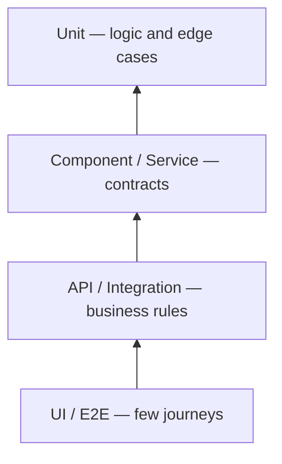

> We cannot test everything — and we should not try to test everything on the UI automation layer. Variety of test layers exist where documented tests can be divided. This helps us reduce execution time, increase fast feedback, and shift left as a side effect.

Picture this: your nightly regression suite takes four hours. Half the failures are environment noise. The other half point to a login API change that nobody noticed because the UI test only checked that the dashboard loaded. Sound familiar? The fix is rarely "add more E2E tests." It is choosing the **right layer** for each kind of check.

## The balancing act

Each activity in a project has a cost and should deliver business value. Testing is no exception. Unnecessary testing causes delays and burns budget. Too little testing hands defective products to end users. Software testing should be done **appropriately** — not maximally.

The triple constraint — cost, quality, and time — is a balancing act every quality practitioner manages. YOUR job is to keep the scope of quality practices inside the cost and time parameters stakeholders set, without hiding risk.

**Scenario:** A product owner asks for "full regression on every commit." YOU translate that into layer-appropriate checks: unit and API on every PR, a thin UI smoke on merge, full regression twice a week. Same confidence, fraction of the wait.

## Cost of defect

Cost of fixing a defect grows exponentially the later it is discovered. Earlier we find it, lower the cost to fix it. As quality analysts, we need to be shifted left and perform quality checks as early as possible.

A typo in a validation rule caught in a **STORY KICKOFF** costs a conversation. The same bug found in production costs a hotfix, a comms plan, and trust you cannot buy back.

## Test pyramid

The test pyramid is the best way to achieve shift left for quality checks. It also shifts our mindset from **defect identification** to **defect prevention** — a theme I explore further in [Keys to become an effective QA](/blog/defect-prevention-mindset/).

Collaborate with app devs to understand how much coverage YOU can push into lower layers. That reduces tests on higher layers that are costly and usually flaky.

Lets understand what belongs on each layer — and what does **not**.

### Unit tests — the wide base

- Functional, cross-functional, UI/JS classes (model, controller, view)
- Boundary values and edge cases
- Immediate feedback
- Safety net for refactors
- Lowest cost of implementation

**Put here:** price calculation rounding, date-boundary logic, input sanitization, state machine transitions.

**Do not put here:** full browser flows, cross-service orchestration, "does the pixel look right on iPhone 12."

**Example:** A discount engine with ten tier rules — ten unit tests with table-driven inputs beat one UI test that clicks through a checkout funnel ten times.

### Integration / component tests — the middle

- Integration points between modules
- API contract tests
- API compatibility across versions
- Regressive data validations
- DB interactions
- Service-level feedback on interactions

**Put here:** repository queries return expected aggregates, message handlers persist correctly, cache invalidation fires when data changes.

**Do not put here:** every permutation of a form field — that belongs in unit or API layers closer to the rule.

**Example:** After a schema migration, component tests on the order service catch broken joins before any tester opens the app.

### API tests — business logic without the browser

- Regressive end-to-end tests at the service boundary
- Functional and cross-functional API scenarios
- Feedback on business rules without UI latency

**Put here:** authorization matrices, negative paths, bulk operations, pagination edge cases.

**Do not put here:** layout, accessibility of buttons, or native mobile gestures.

**Example:** Login — one happy-path UI check; invalid password, locked account, expired token, and role mismatch on the API layer. I dig into this split in [End to End Testing using component strategy](/blog/component-tests/).

### UI / E2E tests — the narrow top

- End-to-end user journeys
- UI interactions in real browsers or devices
- Tests from the user's point of view

**Put here:** critical paths that only make sense when the full stack is wired — checkout, onboarding, publish workflow.

**Do not put here:** exhaustive validation of business rules you already proved downstream. That is how suites become slow, flaky, and ignored.

**Rule of thumb:** If you can delete a UI test and still catch the same bug with a faster layer test, delete it or never write it.

## Features of an effective automation suite

- **Robustness** — failures mean something broke, not that the lab is tired
- **Speed / feedback cycle** — developers run checks before coffee gets cold
- **Debugging** — failures point to a layer and a component
- **Maintainability** — tests read like specs, not archaeology
- **Low proneness to error** — no hard-coded sleeps, shared mutable state, or mystery data

Implementation of the test pyramid helps achieve most of these. The pyramid is not a diagram for slide decks — it is a **budget** for where YOU spend automation effort.

## Quick checklist before you automate

1. Can a unit test prove this?
2. If not, can an API or contract test prove it?
3. Is this journey the only way a user would notice the failure?
4. Will this test still pass if a downstream service is slow but correct?
5. Who updates this test when the UI restyles — and will they?

## What do you think?

How does YOUR team split tests today? Are UI suites doing work that belongs lower? Share what you would move first — I learn as much from readers as from projects.

> Happy Testing :)
