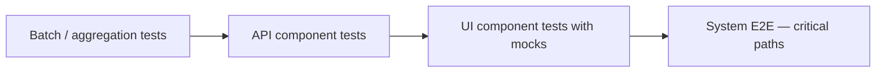

> Component Testing is an approach where we divide automated tests into applicable layers and target specific responsibilities of various components — to reduce interdependencies, execution time, and logic complexity.

If every business rule lives in a single UI journey, one slow warehouse query or one batch job running late turns your "E2E" into a lottery. Component strategy breaks the monolith **in your test design**, not necessarily in your architecture.

This pairs naturally with the [test pyramid](/blog/art-of-automation/). Below is how I apply it on real systems.

## The usual practice — and why it hurts

We have observed a pattern: teams write end-to-end automated tests by **only** targeting the GUI to validate complete business logic.

This approach can work when:

- The backend is very simple with little business logic
- Data is a basic repository with small, stable datasets
- Releases are infrequent and the suite stays small

Otherwise, I do not recommend validating complete business logic on the UI layer alone. YOU pay in minutes per run, flaky failures, and RCA sessions that end with "the batch was still running."

**Before / after snapshot**

| UI-only E2E | Component approach |
|-------------|-------------------|
| One 12-minute test per scenario | Aggregation test ~30s, API test ~5s, UI smoke ~90s |
| Failure: "checkout broken" | Failure: "pricing API returned 409" |
| Blocked when warehouse lags | UI tests use mocked API responses |

## Component approach — break down the logic first

Understand application component responsibilities, then break business logic into parts. That helps YOU write more effective E2Es.

Benefits:

- Reduce flaky tests
- Drastically reduce feedback time
- Accurate failure analysis — pinpoint the flawed area

**Business logic 1:** Data aggregation / batch logic → aggregation component tests

**Business logic 2:** Application service logic → API component tests, UI component tests, then system tests

Lets dig into each layer with examples.

### Data aggregation / batch component tests

If your application involves aggregation or batch processing, test that logic **in this layer only**.

**Why not on UI E2E?**

- Warehouse pulls can take unpredictably long
- Batch schedules add coupling — tests fail when components are out of sync, not when logic is wrong

**Example:** A nightly sales rollup reads 40 tables. A component test feeds a **fixed fixture** of orders and asserts the rollup table — no browser, no cron wait. When the rollup rule changes, YOU know in seconds.

### API component tests

Take login — it is not best practice to test every login combination on the UI.

- Bare minimum happy path on UI E2E
- Invalid credentials, lockout, password expiry, and role-based access on the API layer
- Negative authorization cases without spinning up a browser per variant

**Example scenario:** Ten roles × five protected endpoints = fifty API checks. One UI test confirms a standard user sees the dashboard. The API suite catches a missing 403 before QA spends an afternoon clicking menus.

Cut UI dependency, improve coverage, fewer invalid failures.

### UI component tests — control the data

We may not always control application test data. That creates trouble maintaining datasets for every edge case.

- Mock or stub API responses fed to the GUI
- Validate specific business cases and their reflection in the UI
- Cut backend dependency; make UI tests robust

**Example:** Test "out of stock" banner by returning `{ "stock": 0 }` from a stubbed catalog API — no need to drain inventory in a shared QA database that three other teams use.

### System tests — happy critical paths only

By now YOU have tested at various component levels. System tests prove **integration** — frontend and backend wired together.

Keep the count low. Cover happy critical paths only: place order, register user, submit claim. If a system test fails, component suites should already narrow the blast radius.

## Putting it together on one feature

Imagine **refund processing**:

1. **Batch layer** — settlement file produces refundable rows (fixture input, assert output file)
2. **API layer** — POST `/refunds` with valid, invalid, and duplicate IDs
3. **UI layer** — refund button disabled when API returns `ineligible` (mocked)
4. **System** — one journey: user requests refund, sees confirmation email trigger

Four layers, one feature, no twelve-minute UI marathon.

## When microservices enter the picture

Component boundaries often map to services. The same split applies — see [Microservices Test Strategy](/blog/testing-microservices/) for how contract tests and environments fit in.

## Your turn

Pick one flaky UI test on YOUR project. Which layer could own the assertion instead? Start there; do not rewrite the world in a sprint.

> Happy Testing :)
