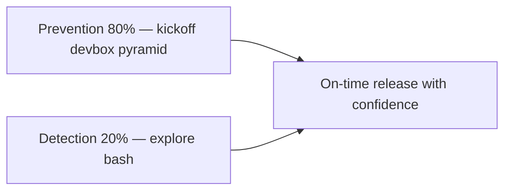

> Prevention is better than cure!
>
> Lets find out how shifting QA mindset from defect **detection** to defect **prevention** can help YOUR team achieve goals without causing testing bottlenecks.

## Why avoid late defect detection

Finding and fixing defects gives the team confidence to release. But finding defects in later SDLC stages delays production. Teams compromise on quality — defects get deprioritized so the release ships on time.

Recall the SDLC flow:

> - Requirement gathering and analysis
> - Development
> - Testing
> - Deployment

What goes wrong when we only hunt defects **after** deployment to dev/QA?

- RCA points to a requirement gap that should have been caught in refinement
- Unit or integration tests were missing or wrong for that module
- E2E/regression suites need updates for the fix
- Retesting and focused regression around the feature

**Cascade effect:**

- Development re-thinks the feature — analysis and coding rework
- Original devs may be on new stories; context switching costs time
- A new dev needs context sharing
- The same dev–QA cycle starts again

I take those points seriously. Gaps I see repeatedly:

- QAs were not in requirement refinement — requirement defects surface post-development
- [Test pyramid](/blog/art-of-automation/) not followed — edge cases missed at unit/integration layers
- Rework on development and testing that could have been avoided

**Mini scenario — late surprise:** A "simple" export feature ships. QA finds the CSV encoding breaks for European customers. Refinement never discussed locales. Two sprints of rework. A 45-minute **STORY KICKOFF** with a sample file would have surfaced it.

## How to focus on defect prevention

QAs should perform quality checks from the **beginning** of requirement gathering. Wear the **end user** hat. Consult on how the feature should behave — what helps, what confuses, what will not work.

When a feature is well groomed and acceptance criteria are finalized, requirement-related issues in later SDLC stages become rare.

### STORY KICKOFF — before code starts

QAs, BA, and dev clear things and agree on ACs and tech approach **before** dev picks up the story. Call it **STORY KICKOFF** (or three-amigos — name matters less than the habit).

**YOU cover:**

- Happy path and edge cases in plain language
- Test data needs and environment assumptions
- Which checks belong in unit, API, and UI layers ([component strategy](/blog/component-tests/))
- Non-functional expectations: performance, accessibility, security

**Outcome:** Devs build with tests in mind; QAs are not surprised on day five of a five-day story.

### Pair during development — early validation

Stay involved while devs work:

- **Code quality** — clear enough for future change
- **Framework fit** — room for enhancements without rewrite
- **Unit/integration coverage** — not only coverage %; data permutations on the same code path cause real bugs
- **Early validation** — demo a stub, run an API test together, validate a state machine on paper

### Devbox — desk check before QA env

When dev work is ready, QAs, BAs, and devs meet. Walk ACs together. Validate the outcome. Feedback is cheap here.

Call it **devbox**, desk check, or volleyball — the pattern is the same: short, focused, on the developer machine or feature branch.

**Mini scenario — devbox win:** Payment story shows success toast but ledger entry is wrong. Caught in devbox in ten minutes. Without it, the bug waits for env deploy, test data setup, and a formal QA pass — same fix, 10× the calendar cost.

### Exploratory testing — with a lighter automation load

After deploy to QA:

- Filter what truly belongs in automated UI E2E — not everything
- Use API tests for business use cases ([pyramid guidance](/blog/art-of-automation/))
- Spend exploratory time on edge cases automation missed

Confidence goes up; effort on repetitive checking goes down.

### Bug bash — before regression

Before full regression, bring the team to **break the app together**. Bug bash finds issues no scripted path would hit — odd device settings, chaotic navigation, "what if I click this twice."

Trust me, it works.

## The 80-20 split

Defect detection is not bad — YOU should not stop doing it. Focus more on **prevention** than detection.

I follow an **80-20 split**: ~80% of effort on prevention (refinement, kickoff, devbox, lower-layer tests), ~20% on detection (exploratory testing, bug bash).

That ratio helped my teams avoid testing bottlenecks and rework. We stuck to timelines and shipped on schedule more often.

## Checklist for YOUR next story

- [ ] QA attended refinement or kickoff
- [ ] ACs testable and agreed in writing
- [ ] Layer ownership clear (unit / API / UI)
- [ ] Devbox done before formal QA handoff
- [ ] UI E2E list trimmed to critical journeys
- [ ] Bug bash scheduled before regression crunch

## What do you think?

Did this change how YOU see testing — hunter vs guardrail builder? Which ritual would help your team most this sprint?

> Happy Testing :)
