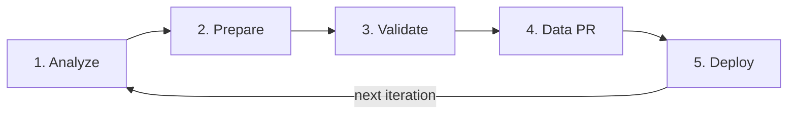

> What is one important factor in a project's success? If you are a QA, your answer might be testing — but what makes testing **good**? Answers vary, yet one thing most of us relate to is **good test data**.

Bad data does not always mean "wrong values." It often means **too much** of the right values, locked in a shared database nobody dares touch.


Everyone in software agrees test data matters. So why do we ignore it until a batch job fails at 2 a.m. or automation times out on a million-row join?

For production-alike data in test environments, see ThoughtWorks [technology radar blip](https://www.thoughtworks.com/radar/techniques?blipid=202110036) — useful context, not a mandate to copy prod wholesale.

## Common test data problems


### Data aggregation / batch runs

Prod-equivalent volume in lower environments causes:

- Longer batch and aggregation time
- More storage cost
- Uncertainty on corner and edge cases
- Slow validation queries
- Automated tests that timeout or run unacceptably long

**Sound familiar?** YOUR UI E2E waits on a warehouse sync that prod needs — but QA only needs ten rows to prove the rule.

### Data complexity

Production-equivalent data is rarely simple:

- New terminologies, patterns, and standards to learn
- Data entangled across sources, tables, schemas
- Scenarios impossible in test env without engineered subsets

### Data accessibility

- Multiple teams share environments — YOU cannot freely mutate data
- Time spent learning DB names, relations, columns, and constraints before changing one row

### Inefficient processes

Challenge the current process. Introduce a model where testers get accurate data faster — engineered data in version control, reviewed like code.

## What we faced on one project


- Prod-equivalent volume on lower environments
- Data size **> 500 GB** (> 40 interrelated tables, millions of rows)
- Batch processing **> 8 hours** — one failed run cost a full day of feedback
- Cloud storage cost climbing
- Multiple teams on shared envs — ad hoc changes broke each other's scenarios
- Views and procedures for UI validation — heavy maintenance, multi-minute queries

We could not [test microservices or components](/blog/component-tests/) fast when the data layer was the bottleneck.

## The solution — engineer, do not clone


Goals:

- Faster aggregation / batch (faster feedback)
- Faster SQL for manual and automated checks
- Lower cloud storage on Dev, QA, Training

**Iterative approach** made reduction manageable and built confidence in reduced data reliability.




### Step 1 — Data analysis

Consider a patient health management DB — row counts in the millions. Do we need millions of patient records to validate the system?


- Analyze existing data, types, and application impact
- Map joins and interconnectivity
- Set target reduced size (KB/MB or row counts per table)
- Remember source control limits — e.g. Git [diff limits](https://docs.github.com/en/repositories/creating-and-managing-repositories/about-repositories#diff-limits) (~1 MB / 20k lines for readable diffs)

### Step 2 — Data preparation

- List data scenarios and corner cases
- **Data skimming chain** — ~10 patients across gender, age, geography may suffice
- Follow the chain for those patients through related tables
- Skim dependent tables consistently


Alternatively, [TABLESAMPLE](https://www.mssqltips.com/sqlservertip/1308/retrieving-random-data-from-sql-server-with-tablesample/) can pick random rows — use with care on join keys.


- Preserve join keys across skimmed tables
- Note duplicate business rows you may collapse or update for edge cases

### Step 3 — Data validation

- Dump to a trial test DB
- Local or Docker app against test DB
- Manual sanity on coverage and edge cases
- Run automation for integrity and compatibility
- **Be patient** — iterative; this step takes time
- Watch Git tracking limits on large SQL dumps

### Step 4 — Data PR

After satisfactory validation:


- Track changes in Git; keep files reviewable
- Export as `.sql` insert scripts

If files exceed diff limits, batch inserts with `awk` — example pattern:

```bash
awk 'BEGIN{match_count=0;} $0~/^INSERT.*VALUES \(/{match_count++;if (match_count%1000!=1) gsub("INSERT INTO .* VALUES \\(","(", $0); if (match_count%1000!=0) gsub(";$",",", $0); print $0}' input.sql > output.sql
```


Raise a **Data PR** — stakeholders review data changes like schema changes.

### Step 5 — Data deployment

Deploy via scripts — e.g. `createSchemaAndData.sh`, `DropAndCreateTable.sql`:


Repository layout example:


**Major steps summary:**


**Iteration cycle:**


## Final outcome


- DB size **< 20 MB** vs **500 GB** (~500,000 MB)
- Batch processing **< 15 minutes** vs **8 hours** — multiple feedback cycles per day
- Cloud storage cost down for Dev, QA, Training
- Teams work in parallel with change management and approvals, zero-downtime deploys
- Complex views and procedures run in **under a second** vs minutes

Those numbers unlocked the [test pyramid](/blog/art-of-automation/) we wanted — API and component tests could run without apologizing for data.

## Steps for the future

**Documenting:** Quick fact sheets — glossaries, key queries, procedures — for onboarding without reading the entire wiki.

**Data management:** As teams grow, formalize ownership: who approves data PRs, how often you refresh subsets, how automation seeds fixtures.

Test data preparation is critical to quality assurance. Forethought, creativity, and industry practices beat copying prod and hoping.

## YOUR next move

Pick one table that dominates storage in YOUR lower env. What is the smallest row set that still tells the truth about one business rule?

> Happy Testing :)
