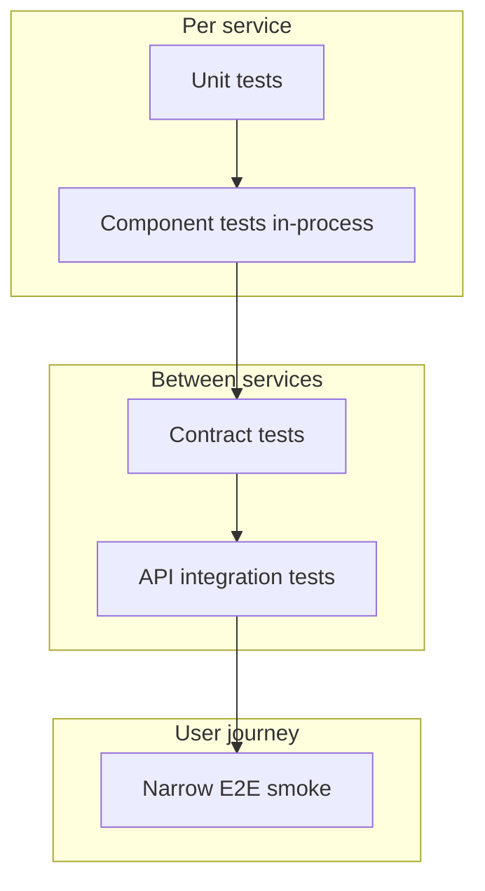

> Testing microservices is not easy when the number of services keeps increasing over time. Complexity grows — database errors, network latency, caching issues, service unavailability. Multiple teams building interconnected services add another layer of chaos.
>
> This problem cannot be solved by choosing an API testing tool and writing as many UI E2Es as possible. A proper thought process and test strategy is needed to understand dependencies and complexity in YOUR architecture.

I have seen teams with forty services and four hundred UI tests still get surprised in production. The issue was never "not enough Selenium." It was **not knowing what each layer should prove**.

## Why projects choose microservices

Microservices are independent or loosely coupled services that can be developed and deployed separately. Teams scale parts of the application without scaling everything.

Benefits:

- **Modularity** — scale one function without scaling the whole app
- **Easier to develop, test, deploy, and maintain** — when boundaries are real
- **Technology choice** — services can use different languages and frameworks where it makes sense

The testing catch: independence in **deployment** does not mean independence in **behavior**. Your users still touch one journey. YOUR strategy must connect the dots.

## Failure modes multiply

In a monolith, a bug is often a stack trace away. In microservices:

- **Network** — timeouts, retries, partial failures
- **Cache** — stale reads, thundering herds after invalidation
- **Version skew** — consumer on v2, provider on v1
- **Data** — eventual consistency, duplicate events
- **Ops** — one service down; others keep accepting traffic

**Scenario:** Order service succeeds; payment service times out; inventory never releases. UI shows "something went wrong." Without layer-appropriate tests, YOU debug via log archaeology across five repos.

## Test pyramid for microservices

Same pyramid as [Understanding Automation Test Layers](/blog/art-of-automation/) — applied per service **and** at boundaries.

| Layer | Proves | Typical owner |
|-------|--------|---------------|
| Unit | Business rules, edge cases | Service dev |
| Component | DB, messaging, cache in one deployable | Service dev + QA |
| Contract | Consumer expectations vs provider | Both teams |
| API integration | Real wire-up in test env | QA + platform |
| E2E | Critical user paths | QA — few tests |

Anti-pattern: **100 UI E2Es across 40 services.** Each UI test drags the whole mesh. Prefer [component strategy](/blog/component-tests/) at service edges.

## Contract testing — when teams ship independently

Consumer-driven contracts answer: "What does my service **need** from yours?"

- Consumer publishes expected request/response shapes
- Provider verifies it still satisfies contracts in CI
- Breaking changes fail **before** integration env, not Friday night

**Example:** Order service expects `POST /payments` → `201` with `{ "paymentId": "uuid" }`. Payment team renames field to `id`. Contract test fails on the payment PR. No multi-team war room.

Contracts complement — not replace — broader API tests. They guard **compatibility**; API tests guard **behavior** with real data and auth.

## Test doubles and stubs

When downstream is unavailable, slow, or expensive:

- **Stubs** — return canned responses for consumer tests
- **Fakes** — in-memory payment or inventory for local dev
- **Service virtualization** — shared lab mimicking partners

Use doubles to keep consumer pipelines fast. Periodically run tests against real providers in a dedicated integration window.

**Rule:** If every developer test requires the full mesh running, YOUR "microservices" dev experience is a distributed monolith with extra steps.

## Environment strategy

| Environment | Purpose | What it proves |
|-------------|---------|----------------|
| Local + doubles | Fast dev feedback | Consumer logic, UI with mocks |
| Ephemeral per PR | Isolated change | Service builds with its contracts |
| Shared integration | Cross-team wiring | Real protocols, real latency |
| Pre-prod | Release candidate | Data shape close to prod, full smoke |

Not every test belongs in every environment. Tag suites: `@contract`, `@integration`, `@smoke`. CI runs the right tag per stage.

## Worked example — order, payment, inventory

**Order service**

- Unit: pricing rules, idempotency key generation
- Component: order persisted, outbox event emitted
- Contract: consumes `PaymentCreated` event schema

**Payment service**

- Unit: card validation, decline codes
- Contract: exposes `POST /payments` per consumer pact
- API: refund and partial capture scenarios

**Inventory service**

- Component: reserve and release on event
- Stub in order tests when inventory lab is down

**E2E (one or two tests)**

- Happy path: place order → pay → stock decrements → confirmation UI

Everything else lives lower. When E2E fails, component and contract suites already narrow the fault.

## Data and [engineered test data](/blog/engineered-test-data/)

Microservices amplify data pain — shared QA databases, event replay, large warehouses. Invest in smaller, intentional datasets for lower envs. UI-only validation over prod-like volume is slow and flaky.

## Test ownership and RACI

Clarify who writes and maintains what:

- **Responsible** — service team for unit/component/contract provider side
- **Consulted** — QA on risk-based API and E2E selection
- **Informed** — release managers on contract failure gates

Without RACI, "someone should have an integration test" means no one does.

## Anti-patterns to call out in retros

- UI test proves a calculation that belongs in unit tests
- No contract between fastest-moving pair of services
- Integration env always red; teams merge anyway
- [Flaky suite](/blog/who-tests-your-test/) blamed on "microservices are hard"

## Strategy checklist

1. Map services on one diagram — mark sync vs async edges
2. Assign pyramid ownership per service
3. Add contracts on the noisiest consumer–provider pairs first
4. Cap E2E count; tie each test to a business journey name
5. Review env cost vs feedback — doubles are not cheating

Microservices reward teams that test **boundaries** as seriously as features. Tools help; strategy decides if YOU sleep before release.

What is the messiest dependency on your architecture diagram? Start testing there.

> Happy Testing :)
