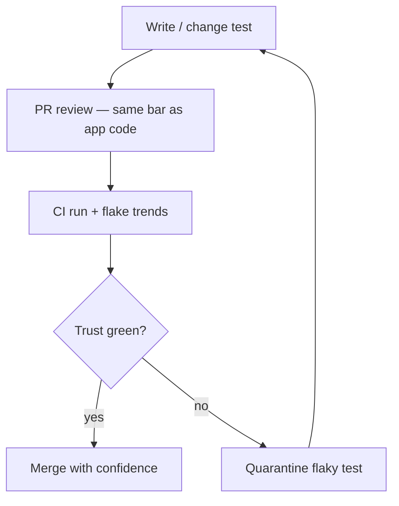

> DO YOU FEEL COMFORTABLE UPDATING YOUR TESTS?
>
> HOW IS THE CODE QUALITY OF YOUR TEST SUITE?
>
> DO YOU TRUST YOUR TESTS AND TEST SUITE?

If those questions sting a little, you are not alone. We ask applications to meet high standards — then we treat test code as a second-class script that "just needs to pass." **Who tests your test?** Until YOU answer that, shift-left and [defect prevention](/blog/defect-prevention-mindset/) rest on sand.

## Why we write tests — and why they rot

We write tests to get fast feedback, prevent regressions, and document behavior. Over time, suites rot:

- Copy-paste steps with one character different
- Hard-coded sleeps instead of synchronization
- Shared test accounts and dirty database state
- Tests coupled to today's DOM, not to user intent
- "Temporary" skips that become permanent

**Scenario:** A login test fails Monday. Someone reruns the job — green. Nobody investigates. Friday it fails in production because the API contract changed and the test was clicking through a cached session. The suite did not protect YOU; it trained the team to ignore red builds.

## Signals you do not trust your suite

Be honest — how many apply on YOUR project?

| Signal | What it usually means |
|--------|------------------------|
| `@flaky` or retry plugins on by default | Tests are liabilities, not assets |
| "Known failure" list in Confluence | Red is normal; alerts are noise |
| Devs merge with "CI is broken again" | Gates are decorative |
| Nobody deletes tests | Fear of unknown coverage |
| QA maintains tests devs never run locally | Feedback loop is too slow |

If green does not mean **safe to merge**, YOU do not have a quality gate — YOU have a mood ring.

## Who tests tests? — owners and habits

Tests are production code with a different user: the team tomorrow.

**1. Authors and reviewers**

- Same PR standards as app code: naming, duplication, clarity
- Review asks: "What defect does this catch? Which layer should own it?"
- Pair on complex flows — same as [STORY KICKOFF](/blog/defect-prevention-mindset/) for features

**2. Linters and static checks**

- Ban `sleep(5000)` without comment
- Enforce page-object or screen-object patterns
- Flag tests with no assertions or only `true === true`

**3. CI analytics — trend, do not just pass**

- Track failure rate per test over 30 days
- Quarantine tests above a flake threshold; fix or delete within a time box
- Fail the build on **new** flakes, not only hard failures

**4. Mutation testing (conceptual)**

- Ask: "If I break the production code slightly, does a test fail?"
- If not, that line is covered but not **protected**
- Full mutation tooling is heavy; spot-check critical modules manually: comment out a validation, run the suite

## Flaky test playbook

When a test flakes:

1. **Reproduce** — run in isolation, then in full suite order
2. **Categorize** — timing, data, environment, order dependency, real bug
3. **Fix root cause** — stub data, wait for event not clock, isolate accounts
4. **Delete if redundant** — a flaky duplicate of a solid API test helps nobody
5. **Time box** — quarantine max two sprints, then fix or remove

**Rule:** A quarantined test counts as **missing coverage**. Track it like open risk.

## Test data and environment — silent killers

Flakes often trace to [test data](/blog/engineered-test-data/) — shared QA DB mutated by another team, clock skew, feature flags half-on.

- Prefer fixtures and factories YOU control
- Document which tests need which data shape
- Align with component tests that mock downstream ([component strategy](/blog/component-tests/))

## Culture: tests as product

- Devs run relevant tests before push — not only CI babysitters
- Celebrate deleting brittle tests replaced by faster layers ([pyramid](/blog/art-of-automation/))
- Incident retros ask: "Which test should have caught this? Why didn't it?"

Prevention mindset applies to **how** we automate, not only **when** we click through the app.

## Quick audit for YOUR suite

1. Pick the ten slowest UI tests — can API or unit layers replace any?
2. List tests skipped or retried last month — fix one this week
3. Ask a dev who does not own QA: "Do you trust CI?" Listen without defending

## Why DO we write tests?

To know we can ship. If the suite lies, we are back to manual panic before release — the bottleneck [defect prevention](/blog/defect-prevention-mindset/) tries to remove.

Who tests your test? **YOU do** — together, with the same seriousness as the feature code.

What is one test on your project you would delete or rewrite first? I would love to hear what stopped you.

> Happy Testing :)
